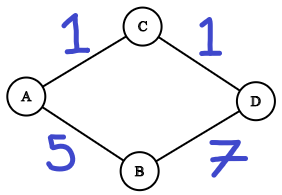

# Searching
Searching algorithms is a great way to practice your coding skills and help you learn about algorithms.  There exists many different searching algorithms, and all algorithms have specific use cases that make them better than others in certain use cases.  

We'll start with some terminology and graph theory to refresh your memory about graphs.  The refresher will get you up to speed for an interview if you're familiar with the content, but you should use the references and your *GoogleFu* to get a rock solid understanding of graph theory and the algorithms.

# Graph Theory 101 and Terminology
- What is a graph?  
A **graph** is a collection of objects that have some relation or connection to one another.  Typically, the objects in a graph are known as **verticies** or **nodes**.  The number of verticies in a graph is commonly represented by `V`.  A vertex can, but doesn't have to be, connected to another vertex by an **edge**.  The number of edges in a graph is commonly represented by `E`.  A common example of a graph might look like:


Notice that the verticies are represented by circles and edges are represented by lines.  We say that two nodes are **neighbors** or **adjacent** to one another when they are connected by an edge.  The idea of adjacent nodes becomes important when we talk about representing the neighbor relationship in code.

The above image is an example of an **explicit graph**.  When we say explicit, it means that we have defined all verticies and edges in the graph.  We defined verticies `0` through `5`, and we defined all edges, such as the edge `(0,4)` that connects vertex `0` to vertex `4`.  Explicit graphs are good at representing well defined objects, like the cities on a map, or the areas and paths in a video game map.  

Another common type of graph in niche fields is an **implicit graph**.  An implicit graph generates verticies and edges algorithmically.  Thus, the implicit graph will be generated at runtime rather than having a well definied example like the graph in the image above.  At most, you only need a single vertex and no edges at a given time.  Implicit graphs contain functions to generate the edges for a vertex.  An exmaple of an implicit graph is `c(n) = n/2`, and you repeatedly apply `c` to the result until your result is less than 1. A more complex version an implicit graph is generated by the *Collatz Problem* where `c(n) = n/2` if `n` is even, or `c(n) = 3n + 1` if `n` is odd.  Choose a starting `n` and apply `c(n)` until you reach 1 (if you reach 1).[[2]](https://stackoverflow.com/questions/58870416/can-you-explain-implicit-graphsin-graph-theory-with-a-simple-example)[[3]](https://martin-thoma.com/the-collatz-sequence/)

Implicit graphs may use slightly different terminology that explicit graphs.  We may talk about implicit graphs in terms of **branching factor** and **depth**.  The branching factor is the number of subsequent verticies for each vertex.  A branch factor may be the same for all verticies, or it may be an average across all verticies.  Depth is the distance between the **root node** and any other node.  The root node is the starting node for a graph or a **tree**, and a tree is a special type of graph that applies a hierarchical structure to graphs. The following image provides an example for branching factor, depth, and trees.


The root node is node `0`.  Notice that each node, except the **leaf nodes** have two **child nodes**.  A leaf node represents the last node on a **branch**, where branch is the same concept as an edge.  A child node is the node that follows another node in the tree heirarchy.  Node `1` is a child node to node `0`, and node `1` is also a parent node to node `3`.  We say that the branching factor for the example tree is 2 because each node (excluding the leaf nodes) has 2 children.  The example tree has a max depth of 2, because you travel 2 nodes until you hit a leaf node.  You could also list all nodes at a specific depth.  Nodes of depth 1 include nodes `1` and `2`.

It is difficult to talk about the number of verticies `V` and the number of edges `E` in an implicit graph, so we may talk about runtime and space complexity in terms of branching factor `b` and depth `d`.  We might say the runtime of a search algorithm is O(`b^d`)

# Sparse vs. Dense Graphs
We like to talk about how **sparse** or **dense** a graph is because it will tell us what algorithms and data structures to use when working with the graph in code.  Sparse and dense are loosely defined terms across the field, but there is some agreement about what they mean.  Informally, a sparse graph contains few edges while a dense graph contrains close the maximum number of edges.  Some say:
- A graph `G(V, E)` is sparse if `|E| = O(|V|)`.  i.e. the number of edges is approximately the same to the number of verticies
- A graph `G(V, E)` is dense if `|E| = O(|V|^2)`. i.e. the number of edges is approximately the same to the number of verticies squared. [[4]](https://stackoverflow.com/questions/12599143/what-is-the-distinction-between-sparse-and-dense-graphs)[[5]](https://web.archive.org/web/20160604215638/http://www.brpreiss.com/books/opus4/html/page534.html)

Let's picture a graph where each node is connected to every other node:


Every vertex is connected to every other vertexin the above example.  Thus you have 6\*5 edges.  We can say that a vertex is connected to itself implicitly, or we can add an explicit edge that connects a vertex to itself, resulting in 6\*6 or 6^2 edges.  6 verticies and 6^2 edges is `|E| = O(|V|^2)`.  That's a dense graph!

On the other hand, a sparse graph has significantly fewer edges than a dense graph.  A sparse graph may even contain verticies that are disconnected from all other nodes as seen below:


Notice that nodes `3` and `6` are disconnected from all other nodes.  There is no reason they must be connected to the rest of the graph.  Also notice that the value for `|E|` is significantly less than `|V|^2`, in fact, `|E| < |V|`.[[4]](https://stackoverflow.com/questions/12599143/what-is-the-distinction-between-sparse-and-dense-graphs)[[5]](https://web.archive.org/web/20160604215638/http://www.brpreiss.com/books/opus4/html/page534.html)


The idea of sparse vs. dense graphs leads into the next topic.  How do we be represent the edges of a graph?

# Adjacency Lists vs. Adjacency Matricies
Two commonly accepted ways to store edges for a graph: an **adjacency list** and an **adjacency matrix**.  

An adjacency list is the list of connected verticies for any given vertex.  For the sparse graph in the previous section, the adjacency list for node `4` would be `[2, 5]`.  You can represent the list with whatever data strucutres your coding language supports (i.e. arrays, vectors, lists, etc.).  If you designed a data structure for your verticies, you might consider adding a list that stores the neighbor nodes (i.e. the edges for that vertex). 

An adjacency matrix is a matrix or 2D array that marks if two verticies are connected.  Typically a 1 represents that two nodes are connected.  The adjacency matrix for the sparse graph in the previous section might look like:
```
0, 1, 0, 0, 0, 0
1, 0, 0, 1, 0, 0
0, 0, 0, 0, 0, 0
0, 1, 0, 0, 1, 0
0, 0, 0, 1, 0, 0
0, 0, 0, 0, 0, 0
```

You check for an edge between two verticies by indexing the row and column with the two vertex IDs.  To check if vertecies `4` and `5` are connected you would index to either [3][4] or [4][3] in the matrix because we take the IDs and subtract by 1 to account for indexing from 0.  Index [3][4] has a value 1, so we know nodes `4` and `5` are neighbors.

## When to Use Adjacency List or Adjacency Matrix
Use an adjacency matrix when:
- You have a dense graph
- when you want O(1) fast lookup time for the existence of an edge between two nodes
- When memory does NOT matter

Don't use an adjacency matrix when:
- You have a sparse graph: you are wasting memory.
- You want to iterate over all neighbors quickly
- You want to add/delte verticies quickly
- You want to optimize space complexity

You use adjacency matricies has `|V|^2` indicies by definition.  Therefore you should use an adjacency matrix when you have a dense graph.  The matrix offers fast lookup time because it uses indicies.  The space complexity of an adjacency matrix is poor because it uses `O(|V|^2)` memory.  It is slow to iterate over neighbors with adjacency matricies because you iterate over non-existent edges (i.e. `0` values in the matrix). It is difficult to add / delete verticies because you must resize/rebuild the matrix.  

Use an adjacency list when:
- You have a sparse graph
- You want to iterate over all neighbors / adjacenct verticies
- You commonly delete verticies
- You want to optimize memory complexity

Don't use an adjacency list when:
- You have a dense graph
- You want to find the presence or absense of an edge

Adjacency lists are good with sparse graphs because the lists are small and don't waste space by storing non-existent edges like an adjacency matrix would.  For the same reason, adjacency lists offer faster iteration over the list of neighbors.  It is easier to add and remove verticies with adjacency lists because you don't have to resize a matrix.  Adjacency lists are typically less space efficient with dense graphs.  It is slower to check if two verticies are connected when using an adjacency list.

# Breadth First Search (BFS)
## Summary
- What is BFS?

Beadth First Search begins at an arbitrary vertex of a graph or the root node of a tree.  BFS will loop through each neighbor of the current vertex in search for the goal.  All neighbors of the current vertex are searched ("expanded") and added to a queue known as the **frontier**.  The frontier is the set of nodes that have been searched, but their own neighbors have yet to be searched and added to the queue.  Once all neighbors of the current node have been added to the queue, BFS wil repeat the process on the next vertex from the queue.  BFS repeats until the queue is empty or a goal vertex if found.  

Another way to think about BFS: BFS searches all verticies that are one edge away from the starting vertex.  Then BFS searches all verticies that are two edges away from the starting vertex.  BFS will continue searching verticies at each depth until there are no verticies left or a goal vertex if found.

The following image shows the search order for a BFS search

[8](https://en.wikipedia.org/wiki/File:Breadth-first-tree.svg)

BFS is a **blind search**.  Blind search means that the search algorithm will consider/search all nodes in a graph if given enough time.  the opposite of blind search is **informed search**.  Informed search means that an algorithm will use a function or **heuristic** to determine if a node is worth exploring.  A **heuristic** estimates if a node will efficiently lead to a goal.

Use BFS when:
1. The answer is close to the root
1. You want the answer that is closest to the root
1. You have a deep tree but solutions are rare (i.e. it would take Depth First Search a long time to find the goal)
1. You want to find the shortest path to a node on a simple graph(Depth First Seach should not be used for this)A
1. If the tree is infinite (Don't use Depth First Search)

Don't Use BFS when:
1. Tree is very wide, you might run out of memory to hold the expanded nodes.  This is because the frontier could be very large
1. The graph is dense / the tree has a large branch factor (the frontier grows very large)
1. Goal nodes are frequent and located deep in the tree

## Runtime Complexity
- Worst case:
1. `O(|V| + |E|)` where `|V|` is the number of verticies and `|E|` is the number of edges
1. `O(b^d)` where `b` is the branching factor and `d` is the depth [[9]](https://en.wikipedia.org/wiki/Breadth-first_search)[[10]](https://www.khanacademy.org/computing/computer-science/algorithms/breadth-first-search/a/analysis-of-breadth-first-search)

- Why?
Because you go through each vertex (`|V|`).  That takes `O(|V|)` time.  Everytime you look at a new vertex `v`, you add all of it's neighbors to the queue.  That takes `O(e)` time, where `e` is equal to the number of edges for that given vertex, and only that vertex.  The sum of all `e` then equals `|E|`, hence `O(|E|)`.  This is why we use addition ( `O(|V| + |E|)`) and not multiplication ( `O(|V| * |E|`)).    That might sound like the answer should be `|V| * |E| ` but that is incorrect.  Saying `|V| * |E|` implies that each vertex has `|E|` number of edges, which is clearly untrue.

## Space Complexity
- Worst case:
1. `O(|V|)` where `|V|` is the number of verticies and `|E|` is the number of edges
1. `O(b^d)` where `b` is the branching factor and `d` is the depth

- Why?
The worst case for BFS occurs when the frontier is largest, because you have to store each vertex in the frontier.  The frontier is largest at the widest part of the graph.  You could imagine a simple graph where all nodes are child nodes of a single root node.  That means we have to add each of these child nodes to the frontier.  Since there are `|V|` nodes in the graph, and `|V| - 1` of these nodes are child nodes, we must store `|V| - 1` nodes in the frontier.  We already store the current node in memeory because we are working with it, thus we get `O(|V|)` complexity.

# Depth First Search (DFS)
## Summary
- What is DFS?

DFS starts at an arbitrary vertex or a root node of a tree.  DFS will search a single branch until it reaches a leaf node.  DFS will then **backtrack** up to the parent node of the leaf node.  Backtrack means.thdtgDFS moess back to a node it was p.eviously a.  DFS will then search as far down the nt branch of the parent node until another leaf node is found.  DFSll repeat eprocess of backtrackig tthe parnt noe and searchin until th parent node ha no more children to search.  Then, DFS will backtrack to the parent node of the parent node.  DFS will continue the process of backtracking until it backtracks to the root node.  DFS will then search the other branches of the tree / graph.  DFS will repeat searching to leaf nodes and backtracking until all nodes have been searched or a goal node is found.[[11]](https://brilliant.org/wiki/depth-first-search-dfs/)[[12]](https://en.wikipedia.org/wiki/Depth-first_search)

The following image shows how DFS searches a tree:

[[13]](https://en.wikipedia.org/wiki/File:Depth-first-tree.svg)

DFS is a **blind search**.  Blind search means that the search algorithm will consider/search all nodes in a graph if given enough time.  the opposite of blind search is **informed search**.  Informed search means that an algorithm will use a function or **heuristic** to determine if a node is worth exploring.  A **heuristic** estimates if a node will efficiently lead to a goal.

Use DFS when:
1. When goal nodes are frequent and deep
1. When the tree is very wide (large branching factor) and you want to avoid BFS
1. When you need better memory effeciency than BFS

AVOID DFS when:
1. The tree is very deep and goal nodes are infrequent.  You might run out of memory / it will take long to find a goal
1. When goals are close to the root, BFS is faster
1. When the tree is infinite, DFS may be more likely to get stuck on an infinite branch.  BFS may have a better time dealing with infinite graphs

## Runtime Complexity
- Worst case:
1. `O(|V| + |E|)` where `|V|` is the total number of verticies / nodes and `|E|` is the total number of edges / branches in the graph.
2. `O(b^d)` where `b` is the branching factor and `d` is the depth

-Why?
As you traverse to each vertex `v` in the set of verticies `V` you will get `O(|V|)` time.  Then, at each node, you will observe each of its edges (although not at the same time since you go down a branch until a leaf node).  This gets you `e - 1` where `e` is the number of edges for the node `v` and only that given node.  Then when you backtrack, you observe the last edge which gives you `e`.  The sum of all `e` for all `v` is `|E|`, hence `O(|E|)`.  Thus a total of `O(|V| + |E|)`

## Space Complexity
- Worst case:
1. `O(|V|)` Where `|V|` is the total number of verticies in the graph.
1. `O(b*d)` Where 'b' is the branching factor and `d` is the depth
- Why?
Because you could construct a graph where the graph is a single file line of nodes.  Each node has a two edges connecting that node to a node behind it and another node in front of it.  The two exceptions being the root node and the leaf node.  Since the entire graph is one large branch, you have to store the entire graph in memory.  Thus, `O(|V|)`.  You also get `O(1*d)` since the braching factor is `1` and the depth is the number of nodes.

Typically, this is not the case.  Often, you will see wider graphs with a smaller depth, which is why DFS has better memory complexity than BFS (*usually* but not always).

# Iterative Deepening Search (IDS) / Iterative Deepening Depth First Search
## Summary
- What is IDS? Iterative deepening search can be can thought of a combination of Depth First Search and Breadth First Search.  IDS searches a tree using DFS but only to a certain depth.  Generally, IDS starts by performing DFS upto a depth a 1, then 2, then 3, and so on.  IDS will terminate the search when it finds a goal node or when there are no nodes left.  The result is IDS generally searches a tree in the same order as BFS.  The difference between IDS and BFS is that IDS performs better in terms of space complexity.  IDS maintains a frontier exactly like DFS.  Thus DFS searches a single branch before moving to the next and does not have to maintain a large frontier as BFS does.  The net result is: you generally have worse time complexity than BFS, but you vastly improve the space complexity (you get the space complexity of DFS) [[16]](https://www.ics.uci.edu/~welling/teaching/271fall09/UninformedSearch271f09.pdf)[[17]](https://www.geeksforgeeks.org/iterative-deepening-searchids-iterative-deepening-depth-first-searchiddfs/)

- When to use / What it's good at

Use IDS when:
- You want to search in the order of BFS but you want to optimize space
- When you can accept slightly slower time performance than BFS 
- Essentially, use IDS anytime you would use BFS but can't afford the memory complexity of BFS

DON'T use IDS when:
- Goal nodes are frequent and deep in the tree (use DFS)
- When you have enough memory to implement BFS
- Basically, anytime when you either (1) have enough memory for BFS or (2) should be using DFS 


## Runtime Complexity
Worst case:
- `O(b^d)` where `b` is branching factor and `d` is depth of the tree
    - Many opt to talk about IDS in terms of `b` and `d` as opposed to `|V|` and `|E|`
- `O(|V| + |E|)` where `|V|` is the total number of verticies in the graph and `|E|` is the total number of edges in the graph [16](https://www.ics.uci.edu/~welling/teaching/271fall09/UninformedSearch271f09.pdf)[17](https://www.geeksforgeeks.org/iterative-deepening-searchids-iterative-deepening-depth-first-searchiddfs/)
Why?
- IDS will end up duplicating searches since it iterates across depths, so it generally runs slower than BFS in the sense that it duplicates searches.  However, since it IDS searches nodes in the same order as BFS, IDS typically finds goals faster than DFS.  Obviously it is subject to change due to different graph structures with different placements and frequencies for goal nodes.
## Space Complexity
- `O(b*d)` where `b` is branching factor and `d` is depth of the tree [[16]](https://www.ics.uci.edu/~welling/teaching/271fall09/UninformedSearch271f09.pdf)[[17]](https://www.geeksforgeeks.org/iterative-deepening-searchids-iterative-deepening-depth-first-searchiddfs/)
    - Many opt to talk about IDS in terms of `b` and `d` as opposed to `|V|` and `|E|`
- `O(|V|)`
Why?
-  IDS maintains a frontier exactly like DFS, where the frontier consists of the current branch and the unsearched neighbors on all depths of that branch.

# Best First Search and Greedy Best First Search
## Summary
- What is Best First Search?

Best First Search searches a graph by expanding nodes that appear most promising according to a certain function or **heuristic**.  A heuristic estimates if a node will efficiently lead to a goal.  The simplest form of a heurisitic is the estimated distance from a frontier node to the goal node.  Best First Search starts at an arbitrary vertex in a graph or a root node in a tree.  BFS will loop through all neighbors of the current node and observe the **cost** of value of the heuristic for each neighbor.  Best First Search adds each neighbor to a Priority-Queue, where the neighbor with the "best" heuristic value will be explore first.  If that neighbor has subsequent neighbors with "better" heuristic costs, then those new neighbors will gain priority in the queue.  The term "better" changes depending on the heuristic used. [[14]](https://en.wikipedia.org/wiki/Best-first_search)

ONLY Using a heuristic such as the estimated distance to the goal node results in Greedy Best First Search.  A Greedy Best First Search might result in suboptimal results beacuse the algorithm prioritizes the distance between a given node and the goal node and ignores the actual cost of the path from the start node to the given node.

Best First Search can be implemented in a simple form by using Greedy Best First Search.  However, it is difficult to talk about specifics without more knowledge about the heuristics used.  Look at the sections on **Dijkstra's** and **A\*** to better understand complexities and use cases for **informed searches**.  If you want to observe how Best First Search behaves compared to normal Breadth First Search, read this amazing post about searching algorithms: [[15]](https://www.redblobgames.com/pathfinding/a-star/introduction.html)

# Dijkstra's 
## Summary
- What is Dijkstra's?
Dijkstra's algorithm is a famous pathfinding algorithm.  It's typically used to find the shortest path between two verticies in a graph.  It can also be used to find the shortest path from one vertex to all other verticies in a graph.  

Dijkstra operates similar to BFS, however Dijkstra implements two important differences.  First, Dijkstra's uses a Pirority queue to sort verticies in the the frontier.  BFS will explore the first vertex from the frontier.  In contrast, Dijkstra will explore the frontier node that has the shortest path to the starting vertex.  Second, Dijkstra only adds a neighbor to the Priority queue if it meets one of two conditions: (1) the neighbor has never been seen before, or (2) the cost / length of the current path to the neighbor (from the current node) is less than the cost/length of the currently stored path to the neighbor.  Basically, it's possible to find multiple paths to any given node, and we shall update that given node if we find a new shorter path to that given node.

- When to use / What it's good at

Use Dijkstra when:
- You need to guarantee that you find the shortest path to a node
- You have a complex graph that implements different edge costs between nodes
    - i.e. The length / cost to traverse an edge from one vertex to another varies from edge to edge.  This design feature of the graph means that you can have multiple paths of different lengths that arrive at the same node
    - Example picture:

    
    - Notice that that there are two routes from vertex `A` to vetex `D`.  You could either go through vertex `C` or vertex `B`.  But the blue numbers next to each edge indicate the path cost (the length) of the edge.  Thus, the length of the path `[A, C, D]` is 2 while the length of the path `[A, B, D]` is 12.  Dijkstra would identify the shorter of the two paths

Don't Use Dijstra's
    - When you don't have costs / path lengths in a graph
    - When you can effectively implement a heuristic function along with the path length calculation.  If you can can add a heuristic function A* might be a better choice
    - When you have obstacles in your graph and you can use A*.  A* can avoid obstacles with a good heuristic function
## Runtime Complexity
Worse case:

- Time complexity can be reduced to `O(|E| + |V|log|V|)` if using a Fibonacci heap for the priority queue.  This is the common answer [18]](http://www-inst.eecs.berkeley.edu/~cs61bl/r//cur/graphs/dijkstra-algorithm-runtime.html?topic=lab24.topic&step=4&course=
- `O((|E| + |V|) * log|V|)` where `|E|` is the total number of edges in the graph and `|V|` is the total number of verticies in the graph [18]](http://www-inst.eecs.berkeley.edu/~cs61bl/r//cur/graphs/dijkstra-algorithm-runtime.html?topic=lab24.topic&step=4&course=
    - This is when using a min-binary heap for the priority queue

Why?

Runtime is related to how we store the nodes in our priority queue.  First, note that we typcailly say `log|V|` and never `log|E|` because at worst, we have all our verticies in the priority queue, hence `|V|` instead of `|E|`.  Then, operations on a priority take log time because we have to maintain an order in the priority queue.  In contrast, a regular queue is unordered.  

A simple (although not entirely correct way) to explain the cost is that we have the cost of BFS `O(|E| + |V|)` but since the operation of maintaining the frontier cost more (because of the logarithm) we get `O((|E| + |V|) log|V|)`.  We have a logarithmic cost for each neighbor we add to the queue, and we do this `|E|` times, so we get one part `O(|E|log|V|)`.  Then, at worst we have to explore each vertex and add remove it from the queue.  Removing from the priority queue takes logarithmic time and we do it `|V|` times, so we get `O(|V|log|V|)`.  *NOTE: this is when using a min-binary-heap*.  Putting it all together: `O(|E|log|V| + |V|log|V|)` which equals `O((|E| + |V|)log|V|)`

A Fibonacci heap can improve the time it takes to add nodes to the priority queue, thus we get `O(|E| + |V|log|V|)` [[18]](http://www-inst.eecs.berkeley.edu/~cs61bl/r//cur/graphs/dijkstra-algorithm-runtime.html?topic=lab24.topic&step=4&course=)
## Space Complexity
Worst case:
- `O(|V|)` Where `|V|` is the number of verticies in a graph.

Why?

At worst case, we're storing all verticies of the graph so we get `O(|V|)`.  You might get worse than this depending on how you remember the best paths to verticies.
# A* (A-Star)
## Summary
- What is A*?
- When to use / What it's good at
## Runtime Complexity


## Space Complexity


# Flash Cards
- Sparse vs. Dense Graphs
- Adjacency Matrix vs. Adjacency List

- DFS Time complexity
- DFS Space complexity
- When to use DFS

- BFS Time complexity
- BFS Space complexity
- When to use BFS

- GBFS Time complexity
- GBFS Space complexity
- When to use Greedy Best First Search

- IDS Time complexity
- IDS Space complexity
- When to use IDS

- Dijkstra's Time complexity
- Dijkstra's Space complexity
- When to use Dijkstra's

- A* Time complexity
- A* Space complexity
- When to use A*

# Terminology
- Graph
- Vertex
- Node
- Edge
- neighbor
- adjacent
- explicit graph
- implicit graph
- undirected graph
- directed graph
- Branching Factor
- Depth
- sparse
- Dense
- Adjacency matrix
- adjacency list
- root node
- leaf node
- child node
- branch
- blind search
- informed search
- heuristic 

# Topics Not Covered
- Connected Graphs vs. Disconnected graphs
- Directional graphs vs. undirected graphs

# References

- [1] [Implicit Graphs by Washington EDU](https://courses.cs.washington.edu/courses/cse373/16wi/slides/18-Implicit-Graphs.pdf)
- [2] [Collatz Implicit Graph on StackOverflow](https://stackoverflow.com/questions/58870416/can-you-explain-implicit-graphsin-graph-theory-with-a-simple-example)
- [3] [Collatz Problem by Martin Thoma](https://martin-thoma.com/the-collatz-sequence/)
- [4] [Sparse vs. Dense Graphs on Stack Overflow](https://stackoverflow.com/questions/12599143/what-is-the-distinction-between-sparse-and-dense-graphs)
- [5] [Sparse vs. Dense Graphs by Bruno P. Reiss](https://web.archive.org/web/20160604215638/http://www.brpreiss.com/books/opus4/html/page534.html)
- [6] [Sparse vs. Dense and Matrix vs. List on CS StackExchange](https://cs.stackexchange.com/questions/54575/a-graphs-density-and-sparsity)
- [7] [Adjacency List and Adjacency Matrix Comparison on Stack Overflow](https://stackoverflow.com/questions/2218322/what-is-better-adjacency-lists-or-adjacency-matrices-for-graph-problems-in-c)
- [8] [Wikipedia BFS image](https://en.wikipedia.org/wiki/File:Breadth-first-tree.svg)
- [9] [Wikipedia BFS](https://en.wikipedia.org/wiki/Breadth-first_search)
- [10] [Khan Academy BFS](https://www.khanacademy.org/computing/computer-science/algorithms/breadth-first-search/a/analysis-of-breadth-first-search)
- [11] [Brillian on DFS](https://brilliant.org/wiki/depth-first-search-dfs/)
- [12] [Wikipedia on DFS](https://en.wikipedia.org/wiki/Depth-first_search)
- [13] [Wikipedia DFS image](https://en.wikipedia.org/wiki/File:Depth-first-tree.svg)
- [14] [Wikipedia on BFS](https://en.wikipedia.org/wiki/Best-first_search)
- [15] [RedBlobGames on A*](https://www.redblobgames.com/pathfinding/a-star/introduction.html)
- [16] [ICS.edu on IDS/IDDS](https://www.ics.uci.edu/~welling/teaching/271fall09/UninformedSearch271f09.pdf)
- [17] [GeeksForGeeks on IDS/IDDS](https://www.geeksforgeeks.org/iterative-deepening-searchids-iterative-deepening-depth-first-searchiddfs/)
- [18] [Dijkstras at EECS at Berkley] (http://www-inst.eecs.berkeley.edu/~cs61bl/r//cur/graphs/dijkstra-algorithm-runtime.html?topic=lab24.topic&step=4&course=)

# Other Great Resources You Should Study
- https://cs.stanford.edu/people/abisee/gs.pdf
- Stanford
    - Comparing BFS and DFS
        - https://cs.stanford.edu/people/abisee/tutorial/bfsdfs.html
    - Comparing BFS vs. Greedy Best First
        - https://cs.stanford.edu/people/abisee/tutorial/greedy.html
    - Comparing Dijkstra's and A*
        - https://cs.stanford.edu/people/abisee/tutorial/customize.html 

- MIT Introduction  to Algorithms for EECS
    - https://ocw.mit.edu/courses/electrical-engineering-and-computer-science/6-006-introduction-to-algorithms-fall-2011/index.htm 
- MIT Opencourseware EECS AI lectures
    - https://ocw.mit.edu/courses/electrical-engineering-and-computer-science/6-034-artificial-intelligence-fall-2010/lecture-videos/
    - Lecture on A*
        - https://ocw.mit.edu/courses/electrical-engineering-and-computer-science/6-034-artificial-intelligence-fall-2010/lecture-videos/lecture-5-search-optimal-branch-and-bound-a/ 
    - Tutorials
        - https://ocw.mit.edu/courses/electrical-engineering-and-computer-science/6-034-artificial-intelligence-fall-2010/tutorials/
    - AI Search complexity
        - http://www.ai.mit.edu/courses/6.034b/searchcomplex.pdf 